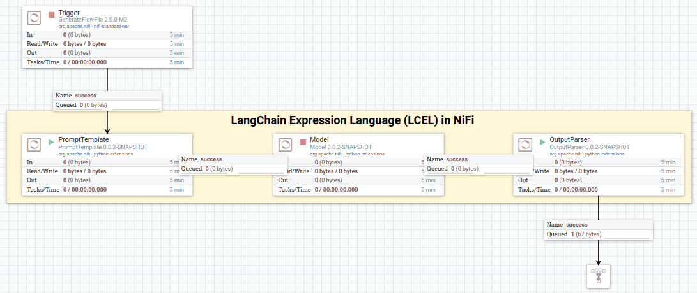
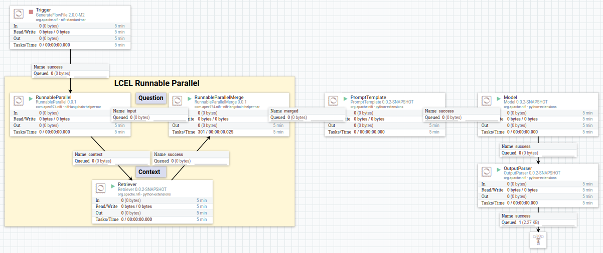
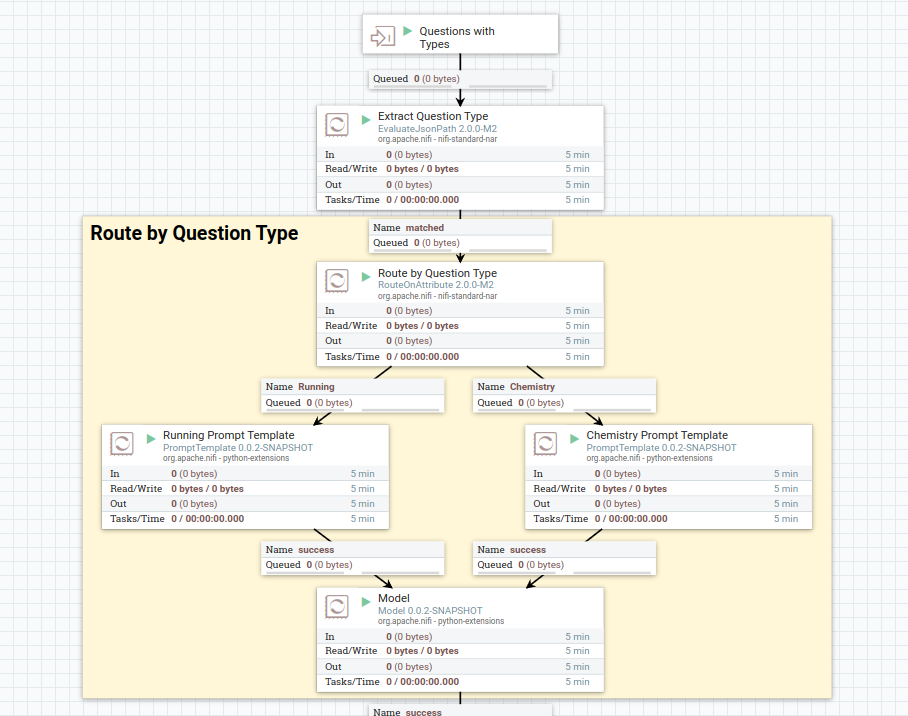

# NiFi LangChain Processors

## Introduction

The NiFi LangChain processors enable the construction of [LangChain](https://python.langchain.com/docs/get_started/introduction) pipelines within [NiFi](https://nifi.apache.org/), leveraging the capabilities of Large Language Models (LLMs) for various data processing tasks. These processors are designed to work with NiFi 2.0's [Python Extensions](https://github.com/apache/nifi/tree/main/nifi-python-extensions), aligning with the [LangChain Expression Language (LCEL)](https://python.langchain.com/docs/expression_language/) paradigm. 

As the implementation focuses on data pipeline functionalities, features specific to interactive applications (e.g., chat history) and autonomous systems (e.g., agent capabilities) are not supported.

Given NiFi's flowfile-based architecture, this integration primarily use the LCEL's `invoke` method to synchronously process individual flowfiles, with potential future support the LCEL's `batch` method on NiFi records.

| LCEL Component | Function | Processors |
| --- | --- | --- |
| Chat Model | Text completion using an LLM | [Model](extensions/nifi-langchain-module/src/main/python/model/Model.py) |
| Output Parser | Parsing LLM outputs | [OutputParser](extensions/nifi-langchain-module/src/main/python/output-parser/OutputParser.py) |
| PromptTemplate | Build prompt templates from user inputs | [PromptTemplate](extensions/nifi-langchain-module/src/main/python/prompt-template/PromptTemplate.py) |
| RunnableParallel | Create parallel, composable execution paths in LCEL | [RunnableParallel](extensions/nifi-langchain-helper/nifi-langchain-helper-processors/src/main/java/com/apex974/nifi/processors/langchain-helper/RunnableParallel.java), [RunnableParallelMerge](extensions/nifi-langchain-helper/nifi-langchain-helper-processors/src/main/java/com/apex974/nifi/processors/langchain-helper/RunnableParallelMerge.java) |
| Retriever | Retrieve relevant context information | [Retriever](extensions/nifi-langchain-module/src/main/python/retriever/Retriever.py) |

Routing (Runnable Branch) can be achieved through existing NiFi processors and are not replicated here.

## Quick Start

To quickly get started with the NiFi LangChain processors, use the Docker image available on GitHub Container Registry. This image comes preinstalled with all the processors and includes example NiFi flows for demonstration.

```bash
docker run --name nifi-langchain \
  -p 8443:8443 \
  ghcr.io/lifan0127/nifi-langchain:latest
```

NiFi web UI: https://localhost:8443 (username: admin, password: nifi+langchain)

### Hello LangChain

Demonstrates a minimal LCEL pipeline with prompt template, model, and output parser.



### Retrieval Augmented Generation (RAG)

Uses `Runnable Parallel` to combine question and context for a RAG system.



### Dynamic Routing

First classifies a question and then use NiFi native `RouteOnAttribute` processor to select a prompt for response synthesis. It demonstrates the composibility of LCEL pipelines.



## Installation

For installation in your NiFi environment (version 2.0 or higher required), download the NAR and ZIP files from the latest release. Copy the NAR file into NiFi's standard extension directory and extract the ZIP's contents into the `python_extension` directory.

## Configuration

Each processor may have one or a few required parameters. For example, the `Model` processor necessitates selecting an LLM model. Additionally, you can directly pass parameters into the underlying LangChain LCEL components by declare NiFi properties with prefixes.

| Processor | Prefix | Examples |
| --- | --- | --- |
| PromptTemplate | langchain.prompt_template. | langchain.prompt_template.length (set prompt length) |
| Model | langchain.model. | langchain.model.model_name (set model name, e.g. 'gpt-4-turbo') |
| Retriever | langchain.retriever. | langchain.retriever. |

The `RunnableParallel` and `RunnableParallelMerge` processors should be used in pairs, with `RunnableParallel` defining paralle paths. Each custom property prefixed with `nifi.runnable_parallel.` define a new output relationship to route your flowfile. For example, custom property `nifi.runnable_parallel.context` defines a new `context` relationship.

## Contribution

Contributions in all forms are highly appreciated!

## References

- NiFi Developer's Guide: https://nifi.apache.org/docs/nifi-docs/html/developer-guide.html
- NiFi Python Extension Developer's Guide: https://nifi.apache.org/documentation/nifi-2.0.0-M1/html/python-developer-guide.html
- LangChain LCEL Documentation: https://python.langchain.com/docs/expression_language/